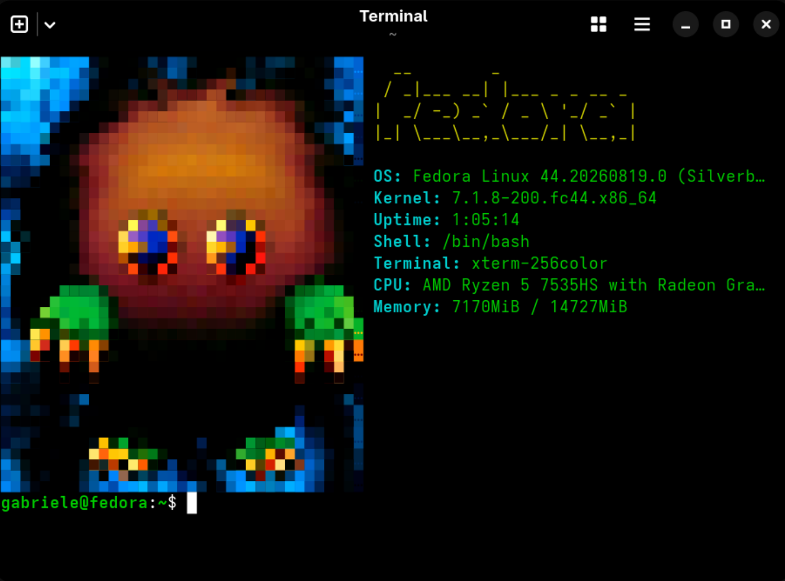

# yugioh-for-terminal

A random Yu-Gi-Oh pixel-art image, rendered in full 256-color ANSI, greets you every time you open a new terminal — right next to a live snapshot of your system stats (neofetch-style).


<!-- Replace the line above with an actual screenshot or terminal recording (asciinema/vhs) once you have one. -->

## Requirements

- Linux, or any terminal that supports 256-color ANSI escape sequences
- Python 3.8+ (3.10+ recommended)
- git

> **Portability note:** system stats (`CPU`, `Memory`, uptime...) are gathered by reading Linux-specific files (`/proc/cpuinfo`, `/proc/meminfo`, `/proc/uptime`). On non-Linux systems the script won't crash, but those specific stats will simply show up as missing.

## Project structure

- `random_art.py` — main script
- `ascii/` — folder containing the ASCII/ANSI art files

## Setup

Pick one of the two options below.

### Option A — virtualenv (recommended)

```bash
git clone https://github.com/Gabbo1909/yugioh-for-terminal.git ~/yugioh-for-terminal
cd ~/yugioh-for-terminal
python3 -m venv .venv
source .venv/bin/activate
python -m pip install --upgrade pip
python -m pip install -r requirements.txt
python random_art.py
```

To run it later without activating the venv:
```bash
./.venv/bin/python random_art.py
```

### Option B — system Python

```bash
git clone https://github.com/Gabbo1909/yugioh-for-terminal.git ~/yugioh-for-terminal
cd ~/yugioh-for-terminal
python3 -m pip install --user -r requirements.txt
python3 random_art.py
```

## Run it automatically when you open a terminal

To run the script once, before the first prompt, add one of the snippets below to your shell's config file. Pick the block matching **both** your setup (A or B) **and** your shell (bash or zsh).

### Bash (`~/.bashrc`)

**If you used Option A (venv):**
```bash
# yugioh-for-terminal
if [ -f "$HOME/yugioh-for-terminal/random_art.py" ]; then
  _yugi_first_prompt() {
    "$HOME/yugioh-for-terminal/.venv/bin/python" "$HOME/yugioh-for-terminal/random_art.py"
    unset -f _yugi_first_prompt
    PROMPT_COMMAND="${PROMPT_COMMAND//_yugi_first_prompt[;]?/}"
  }
  PROMPT_COMMAND="_yugi_first_prompt${PROMPT_COMMAND:+; $PROMPT_COMMAND}"
fi
```

**If you used Option B (system Python):**
```bash
# yugioh-for-terminal
if [ -f "$HOME/yugioh-for-terminal/random_art.py" ]; then
  _yugi_first_prompt() {
    python3 "$HOME/yugioh-for-terminal/random_art.py"
    unset -f _yugi_first_prompt
    PROMPT_COMMAND="${PROMPT_COMMAND//_yugi_first_prompt[;]?/}"
  }
  PROMPT_COMMAND="_yugi_first_prompt${PROMPT_COMMAND:+; $PROMPT_COMMAND}"
fi
```

> Two details worth knowing about this snippet:
> - The `if [ -f ... ]` guard means nothing breaks if you ever move or rename the folder — the hook just silently does nothing instead of erroring.
> - `PROMPT_COMMAND="${PROMPT_COMMAND//_yugi_first_prompt[;]?/}"` **appends to** any existing `PROMPT_COMMAND` instead of overwriting it. Don't replace this line with `PROMPT_COMMAND=''` — that would wipe out any other tool (starship, direnv, etc.) that also hooks into `PROMPT_COMMAND`.

### Zsh (`~/.zshrc`)

Zsh has no `PROMPT_COMMAND`; the equivalent mechanism is the `precmd` hook, registered through `add-zsh-hook` so it stacks with other hooks instead of overwriting them.

**If you used Option A (venv):**
```zsh
# yugioh-for-terminal
if [ -f "$HOME/yugioh-for-terminal/random_art.py" ]; then
  autoload -Uz add-zsh-hook
  _yugi_first_prompt() {
    "$HOME/yugioh-for-terminal/.venv/bin/python" "$HOME/yugioh-for-terminal/random_art.py"
    add-zsh-hook -d precmd _yugi_first_prompt
  }
  add-zsh-hook precmd _yugi_first_prompt
fi
```

**If you used Option B (system Python):**
```zsh
# yugioh-for-terminal
if [ -f "$HOME/yugioh-for-terminal/random_art.py" ]; then
  autoload -Uz add-zsh-hook
  _yugi_first_prompt() {
    python3 "$HOME/yugioh-for-terminal/random_art.py"
    add-zsh-hook -d precmd _yugi_first_prompt
  }
  add-zsh-hook precmd _yugi_first_prompt
fi
```

After editing, open a new terminal or run:
```bash
source ~/.bashrc   # bash
source ~/.zshrc    # zsh
```

## `.venv` and `__pycache__`

- `.venv/` is the virtualenv: an isolated Python environment for this project only.
- `__pycache__/` holds `.pyc` bytecode files generated automatically by Python — safe to delete, they're regenerated as needed.

Suggested minimal `.gitignore`:
```
.venv/
__pycache__/
*.pyc
```

## Adding your own art

Drop a plain-text file into `ascii/`. Two things to know about the format:

- Files use full 256-color ANSI escape codes (`\x1b[38;5;N;48;5;Mm`) applied to half-block characters (`▄`) — the kind of output tools like [chafa](https://hpjansson.org/chafa/) or online ANSI-art converters produce.
- Because raw ESC (`0x1b`) bytes are invisible and easily get stripped by editors, browsers, or copy-paste, files can alternatively store the placeholder character `␛` in place of the real ESC byte — `read_ascii_file()` converts it back automatically at runtime. This keeps the files diffable and safe to view/edit without breaking them.
- If you generate art from an online converter, prefer a **"Download .ans/.txt"** button over copy-pasting from the page — copy-paste is the most common way the ESC byte gets silently dropped.

## Debugging

Debug logging is off by default. To see why a stat might be missing or an art file failed to load:
```bash
YUGI_ART_DEBUG=1 python3 random_art.py
```

## Troubleshooting

- **Figlet banner not showing up on startup**: the script is probably running with the system Python while `pyfiglet` is only installed in the venv (or vice versa). Use the snippet matching your actual setup (Option A vs B above), or install `pyfiglet` at the user level:
  ```bash
  pip3 install --user pyfiglet
  ```
- **`Import "pyfiglet" could not be resolved` warning in your editor**: harmless. `pyfiglet` is an optional dependency wrapped in a `try/except`; the script works without it, just without the hostname banner.
- **You see stray `0m` fragments in the ASCII output**: that art file has a leftover ANSI color-sequence fragment missing its ESC byte; try re-downloading or repairing the file (see "Adding your own art" above).
- **Terminal too narrow**: the script adapts the layout and prints the stats below the ASCII art instead of side-by-side.
- **No stats shown / stats say "unknown"**: expected on non-Linux systems, see the portability note above.

## Credits & rights

- Yu-Gi-Oh! is a trademark of Konami / Studio Dice. This is an unofficial, non-commercial fan project with no affiliation to Konami. All artwork in `ascii/` is ultimately derived from official Yu-Gi-Oh! card illustrations, either directly or indirectly.
- This repository only contains the conversion/rendering script and the derived ASCII/ANSI files; it is not intended for commercial use.

## License

This project's code is licensed under the [MIT License](LICENSE). Note this only covers the code — it does not cover the fan-art-derived or card-illustration-derived assets in `ascii/`, which remain subject to the rights described above.